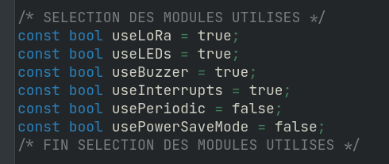
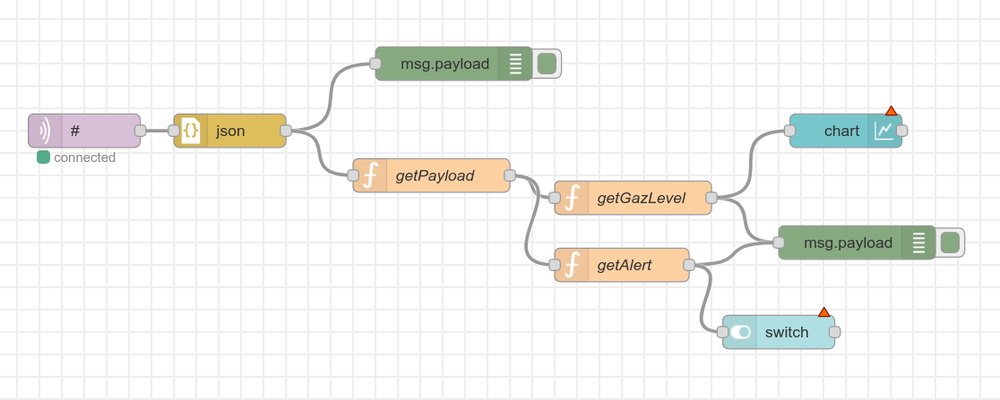

# LoRa Gas Sensor - ISS 2021-2022

**Paul Faure (IR), Arnaud Vergnet (IR)**

This repo contains the source files and some documentation on our mini project about creating a LoRa gas sensor based on nano-particles.

## Table of Contents

- [Content of this repository](#content-of-this-repository)
- [Mini Project](#mini-project)
  - [How the project works](#how-the-project-works)
  - [Node-Red Dashboard](#node-red-dashboard)

## Content of this repository

This repository contains several folders for each type of work.

- [arduino](arduino/): The Arduino source code used in the mini project
- [datasheet](datasheet/): The Datasheet made after the AIME lab on our gas sensor
- [img](img/): Images used in this README
- [kicad](kicad/): KiCad files for this mini-project and the Innovative project. We did not have time to create a fully working KiCad project for this mini project, but worked instead on the innovative project.
- [ltspice](ltspice/): LTspice project describing our Gas Sensor
- [node-red](node-red/): Node-Red flow exported in JSON format for the LoRa mini-project

## Mini Project

The source code used for this project is available in the [arduino](arduino/) folder.

We followed every track, from green to black. We will not go into details on how we solved each track, but will present on overview of our final solution.

### How the project works

We made the arduino source code modular by adding variables at the top to control which modules to enable.

Our mini-project is able to retrieve gas sensor values. It sends periodically those values using The Things Network (TTN). If a value goes over a cerain threshold, an alarm is triggered (buzzer). The state of the alarm is also sent over TTN. To reduce power consumption, it uses hardware interupts to wake up at specific intervals and read new values.

There a four LEDs indicating different states:
- The red LED will turn on when gas is detected, while the buzzer is buzzing
- The blue LED turns on when the arduino is connected to TTN
- The green LED turns on when the device is reading sensor data
- THe yellow LED turns on when the device is setup, indicating it is ready to read sensor data

Sadly, we did not take any picture of the finished product.

### Node-Red Dashboard

You will find bellow a screenshot of our node-red flow. This flow can be imported into node-red using the exported [JSON file](node-red/flows.json). It uses MQTT to connect to The Things Network, retrieves the payload from the json message and retrieves the alert and gas level values. It then shows the gas level value on a dashboard using a chart, and the alert status using a switch.

